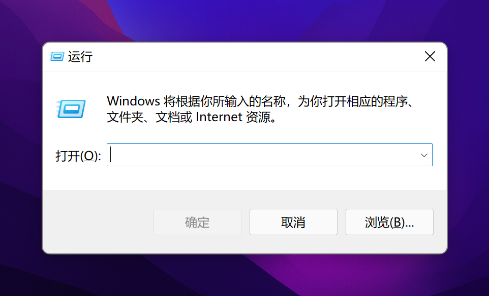
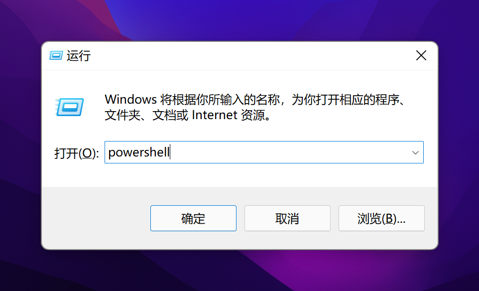
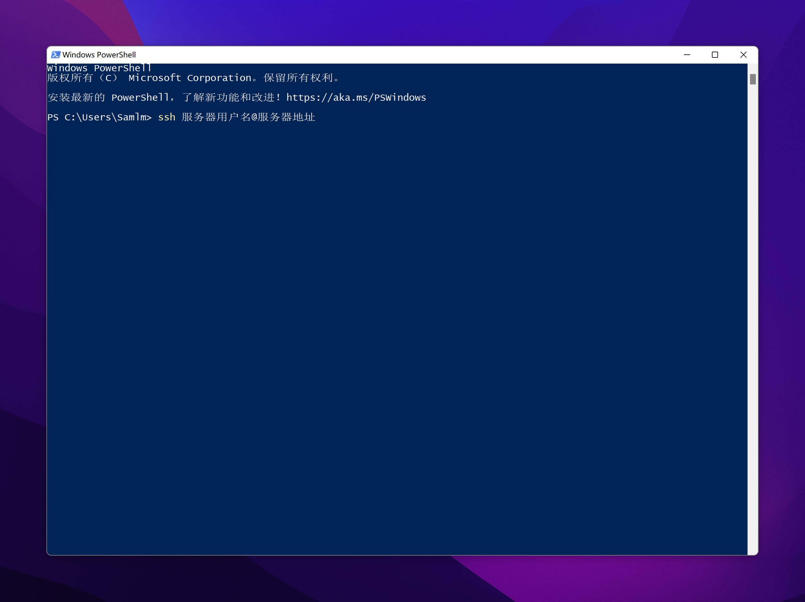
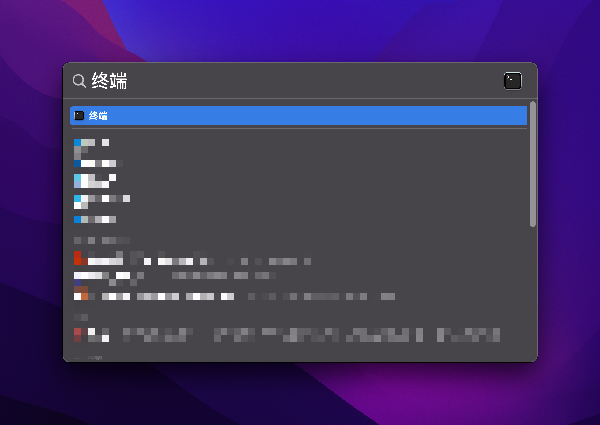
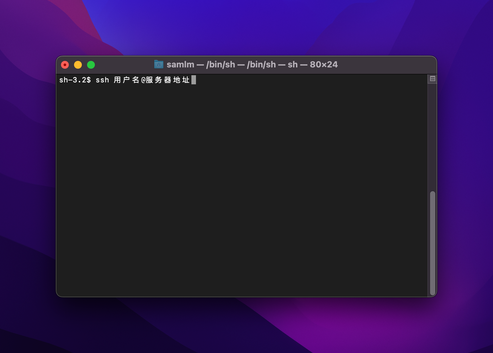
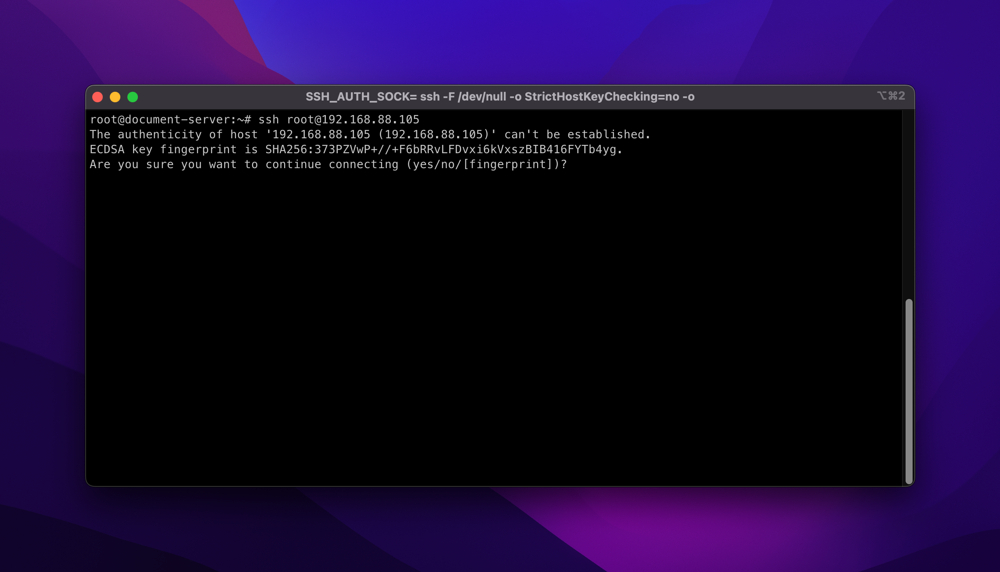
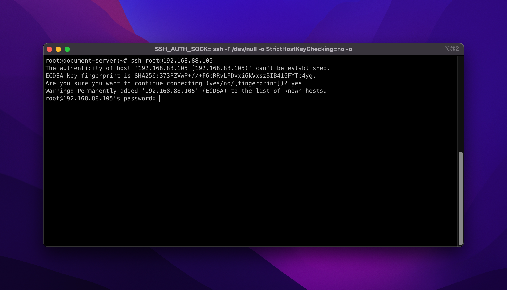
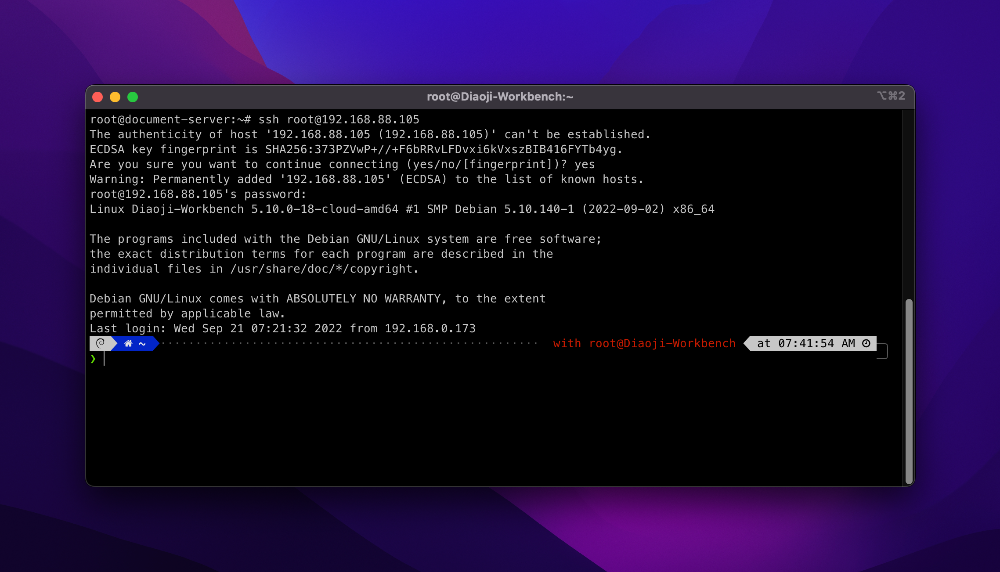

# 选择 SSH 客户端

连接到 Linux 服务器, 通常使用 [SSH 协议](https://baike.baidu.com/item/ssh/10407) . 因此您需要一款兼容 SSH 协议的终端模拟器

## Windows 系统

### 自带的 SSH 命令

按下键盘的 `⊞ Win` + `R` 键, 调出 `运行` 对话框

输入 `powershell`, 并按下键盘 `回车 (Enter)`

在 `powershell` 应用程序中, 键入 `ssh 服务器的用户名@服务器的地址`

剩余部分同 [macOS 系统 - 自带的 SSH 命令一致](#自带的-ssh-命令-1)

## macOS 系统

### 自带的 SSH 命令

按下键盘的 `⌘ command` + `空格 (space)` 键, 调出 `聚焦搜索`

输入 `终端`, 并按下键盘 `回车 (Enter)`

在 `终端` 应用程序中, 键入 `ssh 服务器的用户名@服务器的地址`

服务器的用户名如没有特别说明, 通常为 `root`

如果是第一次连接, 您将会被询问是否信任主机指纹. 此处我们将信任, 输入 `yes` 并按下键盘 `回车 (Enter)`

接下来, 将会询问服务器用户的密码(此处登陆的用户为 `root`).

:::tip

密码输入将不显示任何字符输出, 这是正常情况. 请照常输入密码即可, 密码输入完毕后按下键盘 `回车 (Enter)` 进行验证

:::

如您提供的密码正确, 将会进入服务器的 Shell 界面. 通常为 `/bin/bash` 程序提供命令行界面

图中为 `/bin/zsh` 提供的命令行界面

